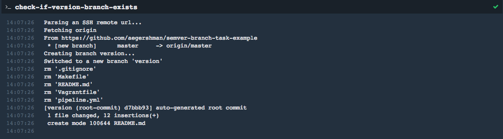
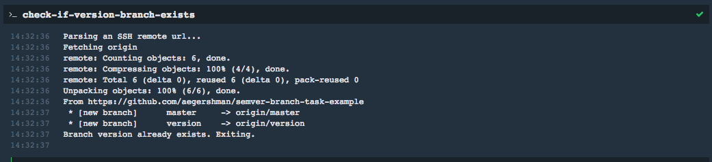

# What?
This task automatically creates the `version` branch in a repository if it doesn't already exist.

If the `version` branch _does_ exist, the task exits successfully.

There are two (success) possibilities:
## 1. version branch doesn't exist, so it's created:


## 2. version branch already exists, so do nothing:


If the task fails, it means it wasn't able to create (or check the existance of) the `version` branch for one reason or another.

# Why?
If you're onboarding old projects into concourse, you probably don't have a `version` branch.

As it stands, the `semver` resource doesn't automatically create the `version` branch. It only creates an initial `version` file.

# How?
Check out the `example_doc` folder.

* You'll find a `Vagrantfile` which will spool up a local concourse server.
* You'll find a `credentials.yml` file, which you'll need to fill out your git ssh key & a github oauth access token with `repo:` access.
* You'll find a `pipeline.yml`, which contains a few examples. All you need to do is point the `project` resource at a github project.
* You'll find a `Makefile`, which will deploy a little example pipeline to the local server. Just run `make test`.

# Access token?
It's really easy. [Check out the GitHub doc on OAuth access tokens here.](https://help.github.com/articles/creating-a-personal-access-token-for-the-command-line/)

# Example pipeline:
This is the exact contents of `pipeline.yml`, but:

```yaml
jobs:

# In this case, we're creating the branch
# after we fail to `put` the version resource.
# Pros:
#    We only check/create version branch if
#    the version couldn't be posted.
#    Since it's pretty rare for the branch not to exist,
#    we don't need to call the method every single time.
# Cons:
#    It requires the job to fail before it checks/creates branch.
- name: check-branch-only-after-failure
  plan:
  - get: version
    params: {pre: rc}
  - get: pipeline-tasks
  - get: project
  - put: version
    params: {file: version/version}
    on_failure:
      task: check-if-version-branch-exists
      file: pipeline-tasks/semver-branch-tool/task.yml
      params: {ACCESS_TOKEN: ((access-token))}

# Another option is to check the task every single time,
# and only `get` the version resource after we've ensured
# the branch exists.
# Pros:
#    If the version branch doesn't exist, it creates it,
#    updates it, then moves on. Build succeeds on one go.
# Cons:
#    We have to check if the version branch exists EVERY single
#    time we run the job. That means we'd be checking if the
#    version branch exists every single time we push a commit.
#    Might slow things down for something that's such an edge case?
- name: check-branch-every-single-job
  plan:
  - get: pipeline-tasks
  - get: project
  - task: check-if-version-branch-exists
    file: pipeline-tasks/semver-branch-tool/task.yml
    params: {ACCESS_TOKEN: ((access-token))}
    on_success:
      get: version
      params: {pre: rc}
  - put: version
    params: {file: version/version}

# Maybe we'd only want to run this task when we onboard
# a project to Concourse. I'm imagining it being used
# during the "pipeline of pipelines" pipeline.
#
# In that case, we'd only run this task when we onboard
# the project into the pipeline.
#
# We wouldn't care about updating the 'version' resource,
# because the 'version' resource would be the responsibility
# of the pipeline that actually does stuff, like "push-webapp"
- name: create-branch-once-during-onboarding
  plan:
  - get: pipeline-tasks
  - get: project
  - task: check-if-version-branch-exists
    file: pipeline-tasks/semver-branch-tool/task.yml
    params: {ACCESS_TOKEN: ((access-token))}

resources:
- name: version
  type: semver
  source:
    driver: git
    uri: git@github.com:aegershman/semver-branch-task-example.git
    branch: version
    file: version
    private_key: ((private-key))

- name: project
  type: git
  source:
    uri: git@github.com:aegershman/semver-branch-task-example.git
    branch: master
    private_key: ((private-key))

- name: pipeline-tasks
  type: git
  source:
    uri: https://github.com/aegershman/pipeline-tasks
    branch: master
```